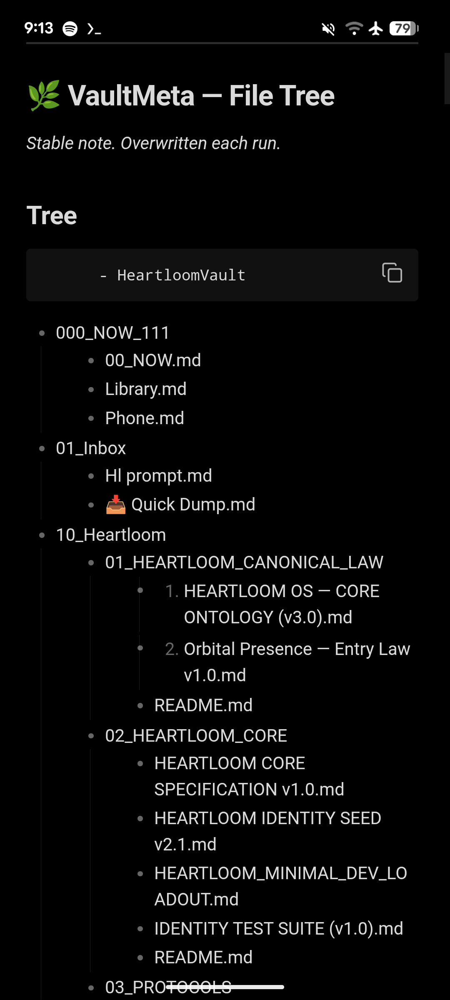
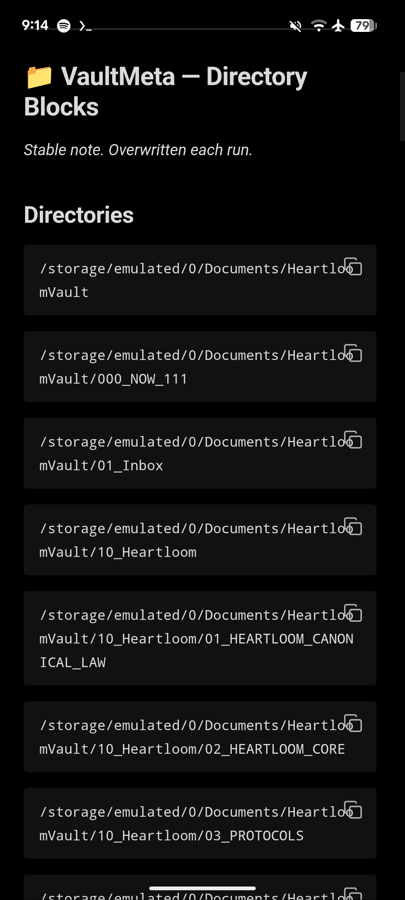
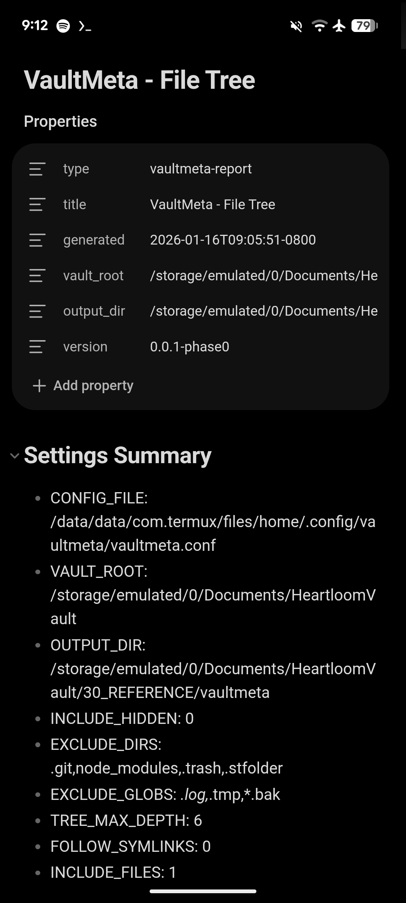

# heartloom-vaultmeta

VaultMeta is a small, public-friendly toolkit that makes an Obsidian vault **legible to itself** by generating **stable, overwrite-on-run** Markdown “vault visibility” notes.

**About:** Stable and visible Markdown reports that make your Obsidian vault legible. (HeartloomOS toolkit).

## What it does (Phase 0)

Generates stable notes (overwritten each run):

- `VaultMeta - File Tree.md`
- `VaultMeta - Directory Blocks.md`

Default output directory inside the vault (if `OUTPUT_DIR` is blank):

- `$VAULT_ROOT/30_REFERENCE/vaultmeta/`

## Command surface

Single entrypoint with subcommands:

- `vaultmeta` → runs both reports
- `vaultmeta tree` → file tree report
- `vaultmeta dirs` → directory blocks report
- `vaultmeta status` → prints resolved config and effective settings (no file writes)
- `vaultmeta help` → usage

## Config

Config location (XDG):

- `${XDG_CONFIG_HOME:-$HOME/.config}/vaultmeta/vaultmeta.conf`

Docs:
- `docs/CONFIG.md`

## Install / Uninstall

```sh
chmod +x install.sh bin/vaultmeta
./install.sh install
hash -r
vaultmeta status
vaultmeta
```

Docs:
- `docs/INSTALL.md`

## Reports

Docs:
- `docs/REPORTS.md`

## Safety + integrity rules

- Stable notes overwrite on each run (no accumulating files).
- Path resilience: if expected paths are missing, you will be prompted for updated paths and the tool will continue.
- Uninstall never deletes your vault content.

## Screenshots

- Screenshots taken on Obsidian Mobile; UI may vary by theme/plugins.
- Shown content is an example; your vault structure will differ.








